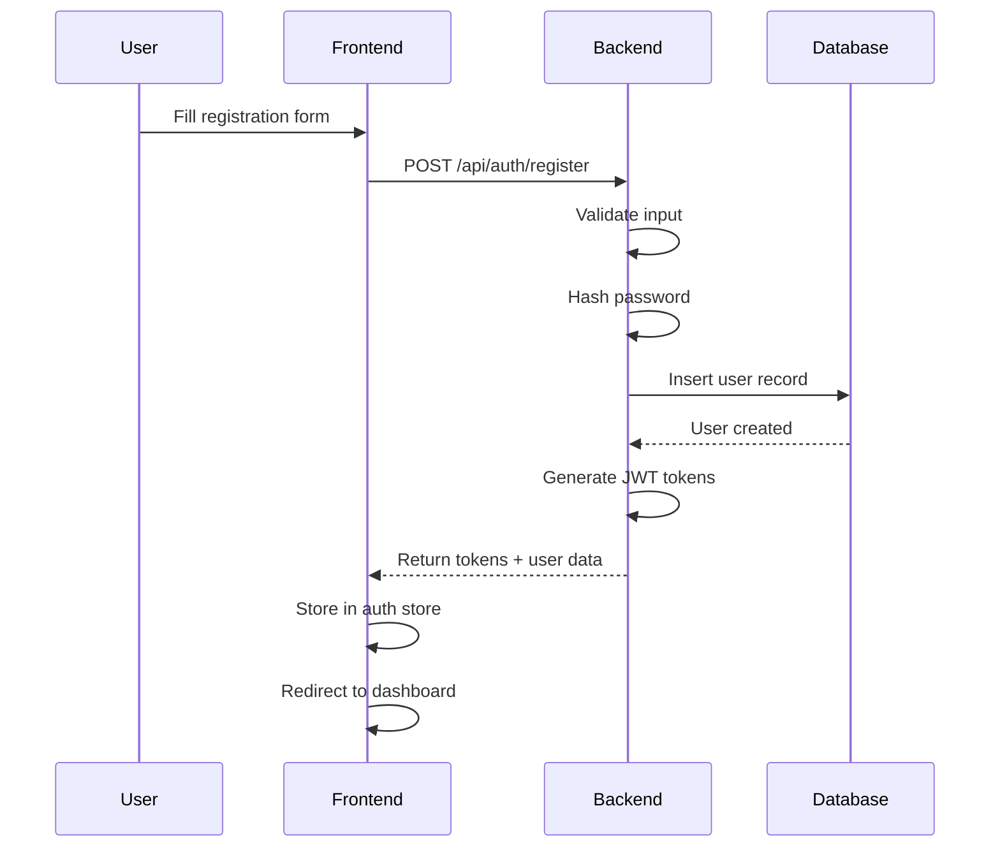
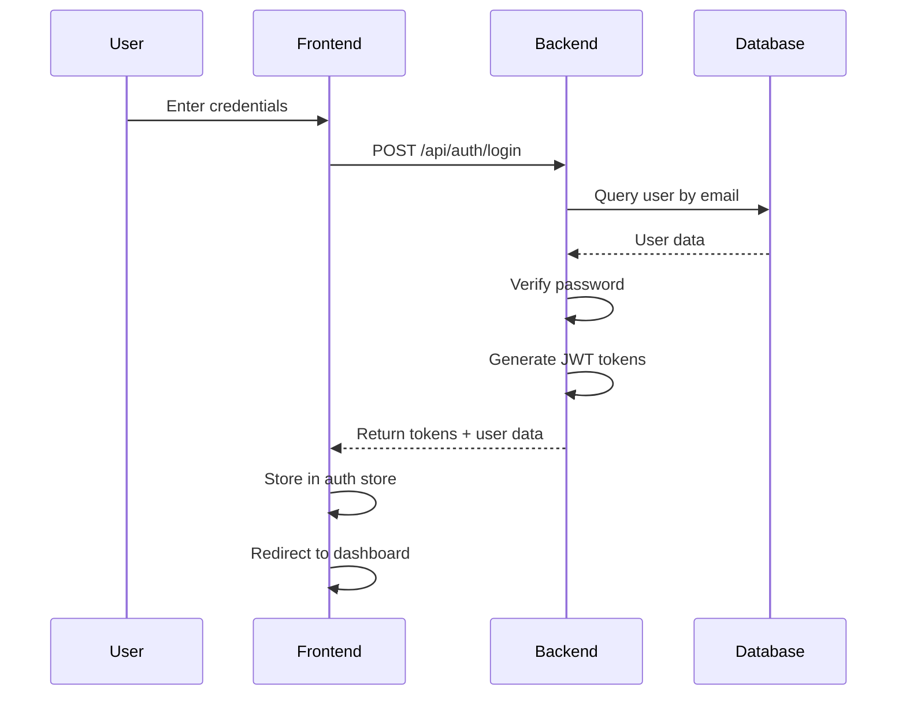
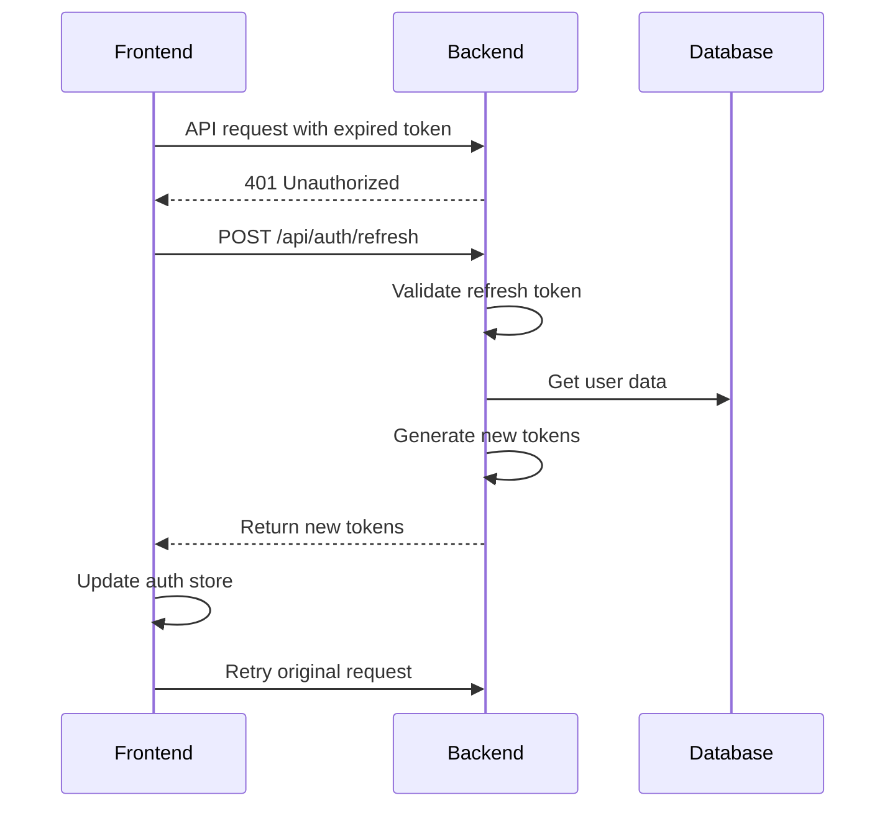

# User Management System Documentation

## Overview

The Crypto AI Agent now includes a comprehensive multi-user authentication system that allows multiple users to manage their personal cryptocurrency portfolios independently. This system provides secure authentication, data isolation, and user profile management.

## Table of Contents

- [Architecture](#architecture)
- [Authentication Flow](#authentication-flow)
- [Database Schema](#database-schema)
- [API Endpoints](#api-endpoints)
- [Frontend Components](#frontend-components)
- [Security Features](#security-features)
- [Configuration](#configuration)
- [Testing Guide](#testing-guide)
- [Troubleshooting](#troubleshooting)
- [Migration Notes](#migration-notes)

## Architecture

### Backend Architecture

```text
┌─────────────────┐    ┌─────────────────┐    ┌─────────────────┐
│   FastAPI App   │    │  Auth Utils     │    │   Database      │
│                 │    │                 │    │                 │
│ • Auth Routes   │◄──►│ • JWT Tokens    │◄──►│ • users         │
│ • Portfolio API │    │ • Password Hash │    │ • portfolio_items│
│ • Middleware    │    │ • Token Refresh │    │ • alerts        │
└─────────────────┘    └─────────────────┘    └─────────────────┘
```

### Frontend Architecture

```text
┌─────────────────┐    ┌─────────────────┐    ┌─────────────────┐
│   Next.js App   │    │  Auth Store     │    │   API Client    │
│                 │    │                 │    │                 │
│ • Login/Register│◄──►│ • User State    │◄──►│ • Auth Headers  │
│ • Dashboard     │    │ • Token Mgmt    │    │ • Auto Refresh  │
│ • Profile       │    │ • Persistence   │    │ • Error Handling│
└─────────────────┘    └─────────────────┘    └─────────────────┘
```

## Authentication Flow

### 1. User Registration



### 2. User Login



### 3. Token Refresh



## Database Schema

### Users Table

```sql
CREATE TABLE users (
    id INTEGER PRIMARY KEY AUTOINCREMENT,
    email TEXT UNIQUE NOT NULL,
    username TEXT UNIQUE NOT NULL,
    hashed_password TEXT NOT NULL,
    full_name TEXT,
    is_active BOOLEAN DEFAULT 1,
    is_verified BOOLEAN DEFAULT 0,
    created_at TEXT NOT NULL,
    updated_at TEXT NOT NULL
);
```

### Password Reset Tokens Table

```sql
CREATE TABLE password_reset_tokens (
    id INTEGER PRIMARY KEY AUTOINCREMENT,
    user_id INTEGER NOT NULL,
    token TEXT UNIQUE NOT NULL,
    expires_at TEXT NOT NULL,
    used BOOLEAN DEFAULT 0,
    created_at TEXT NOT NULL,
    FOREIGN KEY (user_id) REFERENCES users (id)
);
```

### User Sessions Table

```sql
CREATE TABLE user_sessions (
    id INTEGER PRIMARY KEY AUTOINCREMENT,
    user_id INTEGER NOT NULL,
    token TEXT UNIQUE NOT NULL,
    expires_at TEXT NOT NULL,
    created_at TEXT NOT NULL,
    FOREIGN KEY (user_id) REFERENCES users (id)
);
```

### Updated Portfolio Items Table

```sql
CREATE TABLE portfolio_items (
    id INTEGER PRIMARY KEY AUTOINCREMENT,
    user_id INTEGER NOT NULL,
    symbol TEXT NOT NULL,
    amount REAL NOT NULL,
    price_buy REAL NOT NULL,
    purchase_date TEXT,
    base_currency TEXT NOT NULL,
    purchase_price_eur REAL,
    purchase_price_czk REAL,
    source TEXT,
    commission REAL DEFAULT 0.0,
    total_investment_text TEXT,
    created_at TEXT NOT NULL,
    updated_at TEXT NOT NULL,
    current_price REAL,
    current_value REAL,
    pnl REAL,
    pnl_percent REAL,
    FOREIGN KEY (user_id) REFERENCES users (id)
);
```

## API Endpoints

### Authentication Endpoints

| Method | Endpoint | Description | Auth Required |
|--------|----------|-------------|---------------|
| POST | `/api/auth/register` | Register new user | No |
| POST | `/api/auth/login` | Login user | No |
| POST | `/api/auth/refresh` | Refresh access token | No |
| GET | `/api/auth/me` | Get current user info | Yes |
| PUT | `/api/auth/profile` | Update user profile | Yes |
| POST | `/api/auth/change-password` | Change password | Yes |
| POST | `/api/auth/password-reset-request` | Request password reset | No |
| POST | `/api/auth/password-reset-confirm` | Confirm password reset | No |

### Protected Endpoints

All portfolio, alerts, and symbols endpoints now require authentication and filter data by `user_id`:

- `GET /api/portfolio/` - Get user's portfolio
- `POST /api/portfolio/` - Create portfolio item
- `PUT /api/portfolio/{id}` - Update portfolio item
- `DELETE /api/portfolio/{id}` - Delete portfolio item
- `GET /api/portfolio/summary` - Get portfolio summary
- `GET /api/alerts/` - Get user's alerts
- `POST /api/alerts/` - Create alert
- `PUT /api/alerts/{id}` - Update alert
- `DELETE /api/alerts/{id}` - Delete alert
- `GET /api/symbols/tracked` - Get tracked symbols
- `POST /api/symbols/tracked` - Add tracked symbol
- `DELETE /api/symbols/tracked/{symbol}` - Remove tracked symbol

## Frontend Components

### Authentication Store

The authentication state is managed using Zustand with persistence:

```typescript
interface AuthState {
  user: User | null
  accessToken: string | null
  refreshToken: string | null
  isAuthenticated: boolean
  loading: boolean
  error: string | null
  
  // Actions
  login: (credentials: UserLogin) => Promise<void>
  register: (data: UserRegister) => Promise<void>
  logout: () => void
  refreshAccessToken: () => Promise<void>
  clearError: () => void
  setUser: (user: User) => void
}
```

### Pages

1. **Login Page** (`/login`)
   - Email and password form
   - Form validation
   - Error handling
   - Link to registration

2. **Register Page** (`/register`)
   - Email, username, password, full name
   - Password confirmation
   - Form validation
   - Link to login

3. **Profile Page** (`/profile`)
   - Update profile information
   - Change password
   - Account management

4. **Forgot Password** (`/forgot-password`)
   - Email input for reset request
   - Success/error messages

5. **Reset Password** (`/reset-password`)
   - New password form
   - Token validation
   - Password confirmation

### Middleware

Next.js middleware protects routes:

```typescript
export function middleware(request: NextRequest) {
  const authStorage = request.cookies.get('auth-storage')?.value
  let isAuthenticated = false
  
  if (authStorage) {
    try {
      const parsed = JSON.parse(authStorage)
      isAuthenticated = parsed.state?.isAuthenticated || false
    } catch (e) {
      // Invalid auth storage
    }
  }

  // Redirect logic for protected and auth routes
}
```

## Security Features

### Password Security

- **Hashing**: bcrypt with configurable rounds
- **Validation**: Minimum 8 characters
- **Confirmation**: Password confirmation on registration/change

### JWT Tokens

- **Access Tokens**: 30-minute expiration
- **Refresh Tokens**: 7-day expiration
- **Algorithm**: HS256
- **Secret**: Configurable via environment

### Route Protection

- **Frontend**: Middleware redirects unauthenticated users
- **Backend**: Dependency injection for protected endpoints
- **API**: Automatic token validation

### Data Isolation

- **User ID Filtering**: All queries filtered by `user_id`
- **Ownership Verification**: Users can only access their own data
- **Session Management**: Automatic token refresh

## Configuration

### Environment Variables

```bash
# JWT Configuration
JWT_SECRET=your-super-secret-jwt-key-change-this-in-production
JWT_SECRET_KEY=your-secret-key-here

# Database
DATABASE_FILE=data/crypto_portfolio.db

# CORS
CORS_ORIGINS=http://localhost:3000,https://yourdomain.com
```

### Backend Configuration

```python
# backend/app/core/config.py
class Settings(BaseSettings):
    jwt_secret: str = os.getenv("JWT_SECRET", "default-secret")
    jwt_algorithm: str = "HS256"
    jwt_access_token_expire_minutes: int = 30
    jwt_refresh_token_expire_days: int = 7
```

## Testing Guide

### Manual Testing

1. **Registration Flow**

   ```bash
   # Start the application
   ./start.sh
   
   # Navigate to registration
   open http://localhost:3000/register
   
   # Test with different users
   # Verify data isolation
   ```

2. **Login Flow**

   ```bash
   # Test login with valid credentials
   # Test login with invalid credentials
   # Test logout functionality
   ```

3. **Password Reset**

   ```bash
   # Request password reset
   # Check backend logs for token
   # Use token to reset password
   ```

4. **Data Isolation**

   ```bash
   # Create multiple user accounts
   # Add portfolio items for each user
   # Verify users only see their own data
   ```

### API Testing

```bash
# Test registration
curl -X POST http://localhost:8000/api/auth/register \
  -H "Content-Type: application/json" \
  -d '{"email":"test@example.com","username":"testuser","password":"password123"}'

# Test login
curl -X POST http://localhost:8000/api/auth/login \
  -H "Content-Type: application/json" \
  -d '{"email":"test@example.com","password":"password123"}'

# Test protected endpoint
curl -X GET http://localhost:8000/api/portfolio/ \
  -H "Authorization: Bearer YOUR_ACCESS_TOKEN"
```

## Troubleshooting

### Common Issues

1. **"JWT_SECRET not configured" warning**
   - **Cause**: JWT_SECRET not set in .env
   - **Solution**: Add `JWT_SECRET=your-secret-key` to .env

2. **Authentication errors**
   - **Cause**: Backend not running or JWT_SECRET mismatch
   - **Solution**: Check backend status and JWT_SECRET configuration

3. **Data not loading**
   - **Cause**: Not logged in or API errors
   - **Solution**: Check authentication status and browser console

4. **Password reset not working**
   - **Cause**: Email service not configured
   - **Solution**: Check backend logs for reset tokens

### Debug Commands

```bash
# Check service status
./status.sh

# View backend logs
tail -f logs/backend.log

# View frontend logs
tail -f logs/frontend.log

# Check database
sqlite3 data/crypto_portfolio.db ".tables"
```

## Migration Notes

### Data Migration

- **Existing Data**: All existing portfolio data was cleared
- **Fresh Start**: Users need to re-register and recreate portfolios
- **Backup**: Original data was backed up before migration

### Breaking Changes

- **API Authentication**: All endpoints now require authentication
- **Data Structure**: All tables now include `user_id` foreign keys
- **Frontend Routes**: New authentication pages added

### Upgrade Path

1. **Backup existing data** (if needed)
2. **Update environment variables**
3. **Run database migration**
4. **Update frontend dependencies**
5. **Test authentication flow**

## Performance Considerations

### Database Performance

- **Indexes**: User ID indexes for fast filtering
- **Queries**: Optimized queries with user_id filtering
- **Connection Pooling**: Efficient database connections

### Token Management

- **Refresh Strategy**: Automatic token refresh
- **Storage**: Secure token storage in localStorage
- **Cleanup**: Automatic cleanup of expired tokens

### Frontend Performance

- **Lazy Loading**: Authentication pages loaded on demand
- **State Management**: Efficient state updates
- **Caching**: API response caching where appropriate

## Future Enhancements

### Planned Features

- **Email Service**: Real email sending for password reset
- **Two-Factor Authentication**: TOTP support
- **Social Login**: Google/GitHub OAuth
- **User Roles**: Admin/user role system
- **Audit Logging**: User action tracking

### Scalability

- **Database**: PostgreSQL migration for production
- **Caching**: Redis for session management
- **Load Balancing**: Multiple backend instances
- **CDN**: Static asset optimization

## Support

For issues and questions:

1. Check the troubleshooting section
2. Review the logs
3. Test with the provided examples
4. Create an issue with detailed information

---

**Last Updated**: October 23, 2025
**Version**: 2.0.0
**Status**: Production Ready
